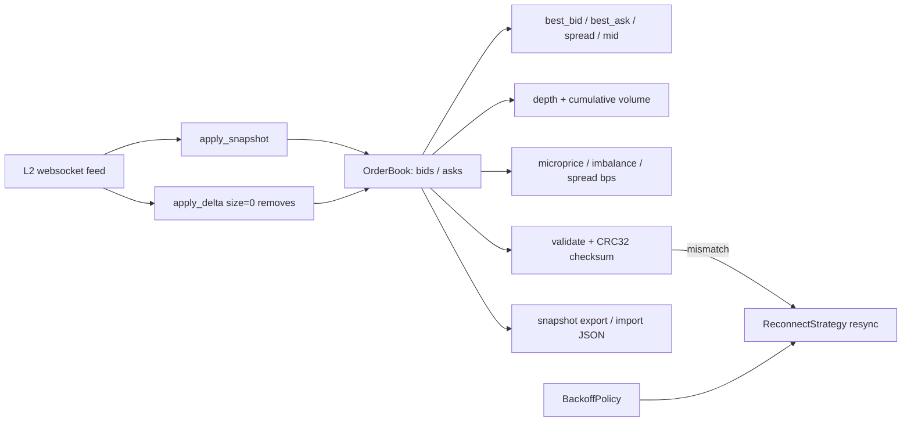

<p align="center">
  
</p>

<h1 align="center">Orderbook WebSocket</h1>

<p align="center">
  <strong>A fast, dependency-light L2 order book engine for live websocket market data — in Python.</strong><br>
  Load a snapshot, stream deltas, aggregate depth, compute microstructure signals, checksum-validate, and resync on reconnect.
</p>

<p align="center">
  <em>Built and maintained by <a href="https://viprasol.com">Viprasol Tech</a> — Fintech Experts. Full-Stack Builders.</em>
</p>

<p align="center">
  <a href="https://github.com/Viprasol-Tech/orderbook-websocket/actions/workflows/ci.yml"></a>
  <a href="LICENSE"></a>
  
  
  
  
  <a href="https://t.me/viprasol_help"></a>
  <a href="https://github.com/Viprasol-Tech/orderbook-websocket/stargazers"></a>
</p>

---

> ## ⚠️ Disclaimer
> This software is for **educational purposes only** and is **not financial advice**. Market data and trading involve substantial risk, including the **total loss of capital**. The order book maintained here reflects only the data you feed it and makes no guarantee of correctness against any live exchange. Always validate against the venue's own documentation and comply with each exchange's terms and your local laws. **Use at your own risk** — Viprasol Tech assumes no responsibility for your trading results.

---

## ✨ Features

- 📖 **L2 order book** — two `price -> size` maps for bids and asks, kept in sync from a snapshot plus a stream of incremental deltas (`size == 0` removes a level, just like a real feed).
- 📊 **Depth aggregation** — sorted depth ladders with running **cumulative volume** (`bid_depth`, `ask_depth`, `volume`), ideal for sizing orders and drawing depth charts.
- 📈 **Microstructure metrics** — order-book **imbalance**, the **Stoikov microprice**, weighted mid, and **spread in basis points** — the signals behind market making and HFT research.
- 🧮 **Checksum & consistency validator** — detect crossed/locked/corrupt books and verify an **OKX-style CRC32** against the exchange to catch desyncs early.
- 🔁 **Reconnect strategy** — pluggable `ConnectionLike` driven through connect → resubscribe → resync, with **exponential backoff** (cap + jitter) and attempt limits.
- 💾 **Snapshot export/import** — serialize the book to stable, diff-friendly JSON and reload it for replay, debugging, or backtests.
- 🖥️ **Rich CLI** — `demo`, `depth`, `metrics`, `validate`, and `export`, all offline and reproducible.
- ⚙️ **Modern tooling** — ruff, mypy (strict), pytest (78 tests), GitHub Actions CI. No network required.

## 🚀 Quickstart

```bash
git clone https://github.com/Viprasol-Tech/orderbook-websocket.git
cd orderbook-websocket
python -m pip install -e ".[dev]"

orderbook-websocket demo       # snapshot + deltas + top of book
orderbook-websocket depth      # sorted depth ladder with cumulative volume
orderbook-websocket metrics    # microprice, imbalance, spread (bps)
orderbook-websocket validate   # consistency checks + CRC32 checksum
orderbook-websocket export book.json
```

## 🧩 Use it in code

```python
from orderbook_websocket import OrderBook, Side, metrics, snapshot, validator

book = OrderBook()
book.apply_snapshot(
    bids={100.0: 5.0, 99.5: 8.0},
    asks={100.5: 4.0, 101.0: 9.0},
)

# Stream deltas exactly as a websocket would push them:
book.apply_delta(Side.BID, price=100.25, size=3.0)  # new best bid
book.apply_delta(Side.ASK, price=100.5, size=0.0)   # level fully consumed -> removed

# Top of book and aggregated depth:
print(book.best_bid, book.best_ask, book.spread)    # 100.25 101.0 0.75
print(book.bid_depth(levels=2))                      # [Level(price=100.25, size=3.0, cumulative=3.0), ...]

# Microstructure signals:
print(metrics.microprice(book))                      # size-weighted fair value
print(metrics.imbalance(book, levels=1))             # buy/sell pressure in [-1, +1]
print(metrics.spread_bps(book))                      # spread in basis points

# Catch a desynced book and resync:
if not validator.validate(book) or not validator.verify_checksum(book, exchange_crc):
    ...  # reload from a fresh snapshot

# Persist and reload state:
snapshot.save(book, "book.json", meta={"symbol": "BTC-USD"})
restored = snapshot.load("book.json")
```

Wiring a real, resilient feed:

```python
from orderbook_websocket import BackoffPolicy, ReconnectStrategy

strategy = ReconnectStrategy(
    policy=BackoffPolicy(base=0.5, factor=2.0, max_delay=30.0, jitter=0.2),
    channels=("book.BTC-USD",),
    max_attempts=None,  # retry forever
)

# Your client implements connect() / subscribe(channels) / resync().
while strategy.should_retry():
    if strategy.reconnect(my_connection):
        break  # connected, subscribed, and resynced
    time.sleep(strategy.next_delay())  # backoff grows with each failure
```

## 🏗️ Architecture



## 📚 API at a glance

| Module / object | Highlights |
| --- | --- |
| `OrderBook` | `apply_snapshot`, `apply_delta`, `best_bid/ask`, `spread`, `mid_price`, `depth`, `bid_depth`, `ask_depth`, `volume`, `is_crossed` |
| `metrics` | `imbalance`, `microprice`, `weighted_mid_price`, `spread_bps` |
| `validator` | `validate` → `ValidationResult`, `crc32`, `verify_checksum` |
| `reconnect` | `BackoffPolicy`, `ReconnectStrategy`, `ConnectionLike` protocol |
| `snapshot` | `to_dict`/`from_dict`, `to_json`/`from_json`, `save`/`load` |
| CLI | `demo`, `depth`, `metrics`, `validate`, `export`, `version` |

## 🗺️ Roadmap

- [x] L2 order book with snapshot + delta application
- [x] Top-of-book helpers (best bid/ask, spread, mid price)
- [x] Sorted depth views and cumulative volume
- [x] Microstructure metrics (microprice, imbalance, spread bps)
- [x] CRC32 checksum + consistency validation
- [x] Reconnect / resubscribe / resync strategy
- [x] Snapshot export & import
- [ ] Live websocket adapters (Binance, Coinbase, Kraken, OKX)
- [ ] Sequence-gap detection from exchange sequence numbers
- [ ] Rolling metric history and streaming aggregations

## ❓ FAQ

**Does it connect to an exchange?**
No — this is the *engine*. It maintains and analyzes the book from data you feed it, so it is trivial to test and embed. Adapters are on the roadmap; the `ReconnectStrategy` + `ConnectionLike` protocol is the seam to plug your transport into.

**Why does the CRC32 not match my exchange?**
Venues differ in level count and decimal precision. Pass your venue's `depth` and `precision` to `crc32` / `verify_checksum`; the default follows the common OKX-style `price:size` convention.

**What is the microprice and why use it over the mid?**
The microprice weights the bid/ask by their imbalance, leaning toward the side likely to be hit. It is a sharper short-horizon predictor of the next trade price than the plain mid.

**Any heavy dependencies?**
No. Runtime uses `pydantic`, `typer`, and `rich`; the engine itself is pure standard-library Python.

## 🤝 Contributing

PRs welcome — see [CONTRIBUTING.md](CONTRIBUTING.md) and our [Code of Conduct](CODE_OF_CONDUCT.md). Please run `ruff check .`, `ruff format .`, `mypy src`, and `pytest` before opening a PR.

## Contact — Viprasol Tech Private Limited

- Website: [viprasol.com](https://viprasol.com)
- Email: [support@viprasol.com](mailto:support@viprasol.com)
- Telegram: [t.me/viprasol_help](https://t.me/viprasol_help) | WhatsApp: +91 96336 52112
- GitHub: [@Viprasol-Tech](https://github.com/Viprasol-Tech) | [LinkedIn](https://www.linkedin.com/in/viprasol/) | X [@viprasol](https://twitter.com/viprasol)

> *Viprasol Tech — fintech software, algorithmic trading systems, MT4/MT5 bots, AI voice agents, and B2B SaaS. Need a custom build? [Get in touch](mailto:support@viprasol.com).*

## License

[MIT](LICENSE) (c) 2025 Viprasol Tech Private Limited
