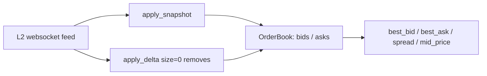

<p align="center">
  
</p>

<h1 align="center">Orderbook WebSocket</h1>

<p align="center">
  <strong>Live order book client with L2 snapshot + delta application — in Python.</strong><br>
  Load an L2 snapshot, stream in incremental deltas, and read the top of book in real time.
</p>

<p align="center">
  <em>Built and maintained by <a href="https://viprasol.com">Viprasol Tech</a> — Fintech Experts. Full-Stack Builders.</em>
</p>

<p align="center">
  <a href="https://github.com/Viprasol-Tech/orderbook-websocket/actions/workflows/ci.yml"></a>
  <a href="LICENSE"></a>
  
  <a href="https://t.me/viprasol_help"></a>
  <a href="https://github.com/Viprasol-Tech/orderbook-websocket/stargazers"></a>
</p>

---

> ## ⚠️ Disclaimer
> This software is for **educational purposes only** and is **not financial advice**. Market data and trading involve substantial risk, including the **total loss of capital**. The order book maintained here reflects only the data you feed it and makes no guarantee of correctness against any live exchange. Always validate against the venue's own documentation and comply with each exchange's terms and your local laws. **Use at your own risk** — Viprasol Tech assumes no responsibility for your trading results.

---

## ✨ Features

- 📖 **L2 order book** — two `price -> size` maps for bids and asks, kept in sync.
- 📸 **Snapshot load** — `apply_snapshot(bids, asks)` replaces the whole book atomically.
- 🔁 **Incremental deltas** — `apply_delta(side, price, size)`; a `size` of `0` removes the level, exactly like a real websocket feed.
- 📈 **Top of book** — `best_bid`, `best_ask`, `spread`, and `mid_price` derived on demand.
- 🧪 **No network required** — pure in-memory logic, trivial to test and embed.
- 🖥️ **CLI** — `orderbook-websocket demo` builds a book, applies deltas, and prints the top of book.
- ⚙️ **Modern tooling** — ruff, mypy (strict), pytest, GitHub Actions CI.

## 🚀 Quickstart

```bash
git clone https://github.com/Viprasol-Tech/orderbook-websocket.git
cd orderbook-websocket
python -m pip install -e ".[dev]"

# Build a book from a snapshot, apply deltas, and print best bid/ask/spread:
orderbook-websocket demo
```

## 🧩 Use it in code

```python
from orderbook_websocket import OrderBook, Side

book = OrderBook()
book.apply_snapshot(
    bids={100.0: 5.0, 99.5: 8.0},
    asks={100.5: 4.0, 101.0: 9.0},
)

# A new best bid arrives over the feed:
book.apply_delta(Side.BID, price=100.25, size=3.0)
# The old best ask is fully consumed -> size 0 removes the level:
book.apply_delta(Side.ASK, price=100.5, size=0.0)

print(book.best_bid)   # 100.25
print(book.best_ask)   # 101.0
print(book.spread)     # 0.75
print(book.mid_price)  # 100.625
```

## 🏗️ Architecture



## 🗺️ Roadmap

- [x] L2 order book with snapshot + delta application
- [x] Top-of-book helpers (best bid/ask, spread, mid price)
- [ ] Sorted depth views and cumulative volume
- [ ] Sequence-gap detection and resync triggers
- [ ] Live websocket adapters (Binance, Coinbase, Kraken)

## 🤝 Contributing

PRs welcome — see [CONTRIBUTING.md](CONTRIBUTING.md) and our [Code of Conduct](CODE_OF_CONDUCT.md).

## Contact — Viprasol Tech Private Limited

- Website: [viprasol.com](https://viprasol.com)
- Email: [support@viprasol.com](mailto:support@viprasol.com)
- Telegram: [t.me/viprasol_help](https://t.me/viprasol_help) | WhatsApp: +91 96336 52112
- GitHub: [@Viprasol-Tech](https://github.com/Viprasol-Tech) | [LinkedIn](https://www.linkedin.com/in/viprasol/) | X [@viprasol](https://twitter.com/viprasol)

> *Viprasol Tech — fintech software, algorithmic trading systems, MT4/MT5 bots, AI voice agents, and B2B SaaS. Need a custom build? [Get in touch](mailto:support@viprasol.com).*

## License

[MIT](LICENSE) (c) 2025 Viprasol Tech Private Limited
